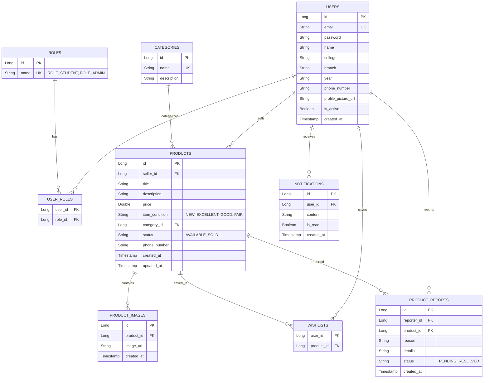

# CampusExchange 🎓💼

CampusExchange is a robust, full-stack student-to-student marketplace web application designed for college campuses. It allows students to securely buy and sell second-hand educational items (engineering books, lab coats, calculators, cycles, etc.) within their campus directory.

The application follows an **enterprise-grade, layered architecture** using Java Spring Boot on the backend and React.js with Material UI (MUI) on the frontend. It features stateless JWT authentication, role-based authorization, multi-image upload capabilities, dynamic search filters, wishlists, alert notifications, and an admin moderation panel.

---

## 🚀 Core Tech Stack

- **Backend**:
  - Java 21/25 (LTS)
  - Spring Boot 3.3.x
  - Spring Security 6.x (Stateless JWT Authentication)
  - Spring Data JPA & Hibernate
  - MySQL Database
  - Maven Build System
- **Frontend**:
  - React 18+ (Vite)
  - Material UI (MUI) v5
  - Axios (with automatic JWT injection interceptors)
  - React Router DOM v6

---

## 🏛️ Architecture & Project Structure

The project is split into two root directories:
- `/backend`: Standard Spring Boot layered package structure.
- `/frontend`: Responsive React single-page app structure.

### Backend Package Layout (`com.campusexchange.campus_exchange`)
```
├── config
│   ├── DatabaseSeeder.java      # Seeds default roles, categories, and test users
│   ├── SecurityConfig.java      # CORS, stateless sessions, and endpoint filter rules
│   └── WebConfig.java           # Maps physical uploaded files statically to URLs
├── controller
│   ├── AdminController.java     # Secured moderator operations (hasRole('ADMIN'))
│   ├── AuthController.java      # Login & register endpoints
│   ├── CategoryController.java  # Public category lookups
│   ├── ProductController.java   # Public searches and secure listing edits
│   └── UserController.java      # Student profile, wishlist, and notification checks
├── dto
│   ├── CategoryDto.java         # Catalog category request/responses
│   ├── LoginRequest.java        # Credentials check structure
│   ├── JwtResponse.java         # Token package returned to client
│   ├── UserDto.java             # Profile edit payloads
│   ├── ProductRequestDto.java   # Listing form validations
│   ├── ProductResponseDto.java  # Listing detail packages
│   └── ReportRequest/Response   # Dialog moderation payloads
├── entity
│   ├── ERole.java               # Enum values (ROLE_STUDENT, ROLE_ADMIN)
│   ├── Role.java / User.java    # Database user mapping
│   ├── Category.java            # Listing classifications
│   ├── Product.java             # Product listings data
│   ├── ProductImage.java        # Listing multi-image rows
│   ├── ProductReport.java       # Fraud flags log
│   └── Notification.java        # Alerts logs
├── exception
│   ├── GlobalExceptionHandler   # Handles validation/custom errors returning JSON
│   └── Custom Exceptions        # ResourceNotFound, BadRequest, Unauthorized
├── repository
│   └── JPA Interfaces           # Spring Data repositories with custom JPQL queries
├── security
│   ├── AuthEntryPointJwt.java   # Formats unauthorized HTTP 401 response formats
│   ├── AuthTokenFilter.java     # Extracts, validates JWT, and registers security context
│   ├── JwtUtils.java            # Generates, signs, parses, and validates HMAC-SHA JWTs
│   └── UserDetailsImpl/Service  # Bridges database User entity with Security Principal
├── service
│   └── Interfaces & Impls       # UserService, ProductService, FileStorageService, etc.
└── utils
    └── DtoConverter.java        # Maps JPA Entities to clean DTOs (separates concerns)
```

---

## 🗄️ Database Design (Entity Relationship Diagram)

Below is the normalized relational model mapping MySQL tables, foreign key constraints, and Many-to-Many associations:



---

## 🔌 API Documentation (Endpoints)

All endpoints prefix: `/api/v1`

### 1. Authentication Endpoints
- `POST /auth/register`: Creates a student account.
- `POST /auth/login`: Verifies password and returns JWT token and details.

### 2. Public Catalog Endpoints
- `GET /categories`: Lists all classification categories.
- `GET /products`: Multi-parameter dynamic search/filter:
  - Params: `search` (keyword), `categoryId`, `college` (college filter), `minPrice`, `maxPrice`, `status` (AVAILABLE, SOLD), `page`, `size`, `sortBy`, `sortDir`.
- `GET /products/{id}`: Returns details of a specific item listing.

### 3. Student Operations (Requires Authentication)
- `POST /products` (Multipart Form): Creates a product listing with multiple images.
- `PUT /products/{id}`: Updates textual product listing details.
- `PATCH /products/{id}/sold`: Sets listing status to `SOLD`.
- `DELETE /products/{id}`: Deletes a listing (restricted to seller).
- `POST /products/{id}/report`: Flags/reports a fraudulent product.
- `GET /users/profile`: Retrieves current student's profile details.
- `PUT /users/profile`: Updates current student's details.
- `POST /users/profile/picture` (Multipart): Uploads a custom profile photo.
- `GET /users/my-products`: Lists products posted by the logged-in student.
- `GET /users/wishlist`: Retrieves the student's bookmarked listings.
- `POST /users/wishlist/{productId}`: Toggles wishlist status (bookmark/remove).
- `GET /users/notifications`: Lists student alerts and inbox logs.
- `PATCH /users/notifications/{id}/read`: Marks notification as read.
- `PATCH /users/notifications/read-all`: Marks all notifications as read.

### 4. Admin Operations (Requires `ROLE_ADMIN`)
- `GET /admin/users`: Lists all users on the platform.
- `PATCH /admin/users/{id}/status?isActive={true/false}`: Blocks/bans or restores a user.
- `GET /admin/reports/pending`: Displays pending product reports log.
- `PATCH /admin/reports/{id}/resolve?action={DISMISS/DELETE_PRODUCT}`: Audits reports. Dismisses flags or deletes products.
- `POST /admin/categories`: Creates a new category.
- `PUT /admin/categories/{id}`: Edips category details.
- `DELETE /admin/categories/{id}`: Deletes a category.

---

## 🛠️ How to Setup & Run locally

### 1. Database Setup
- Ensure MySQL is running on `localhost:3306`.
- Create database `campus_exchange`:
  ```sql
  CREATE DATABASE campus_exchange;
  ```
- Adjust backend credentials in `backend/src/main/resources/application.yml` if your local database password differs from `Password123`.

### 2. Running Backend (Spring Boot)
- Navigate into `/backend` and compile/start using the Maven wrapper:
  ```bash
  .\mvnw.cmd spring-boot:run
  ```
- The backend will start on port `8080`.
- Programmatic seeder will seed categories, default roles, and two default users.

### 3. Running Frontend (React)
- Navigate into `/frontend` and spin up the development server:
  ```bash
  npm run dev
  ```
- The frontend client will launch at `http://localhost:5173`.

---

## 💡 Key Design Highlights (Interview Prep)

- **Pure Java Encapsulation (JDK 25 Compliance)**: Code avoids bytecode-altering compiler hacks (like Lombok) which crash on newer JDKs. Encapsulation is written in clean, standard Java (custom builders, explicit constructor injection), showing interviewers you understand clean OOP rules.
- **DTO Pattern Isolation**: Direct JPA Entity models are never exposed to HTTP controllers. This prevents over-posting attacks and decouples the REST API from database schema changes.
- **Stateless Security**: Spring Security relies on JWT headers, avoiding memory-heavy HTTP session state on the server.
- **Dynamic JPQL Queries**: The product repository uses single-statement dynamic JPQL parameter parsing to perform search, filtering, and sorting, avoiding heavy Hibernate Specifications.
